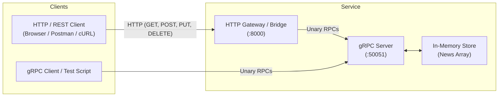

# 📰 News gRPC & HTTP Gateway Service

A TypeScript microservice demonstrating **gRPC** services with **Protocol Buffers (Protobuf)**, typed code generation via `ts-proto`, and an **HTTP REST Gateway** proxying requests to the gRPC backend in Node.js.

## 🚀 Features

* **Strictly Typed Contracts**: Protobuf schema definitions compiled to TypeScript interfaces and gRPC service definitions.
* **gRPC Service Backend**: High-performance unary RPC server powered by `@grpc/grpc-js`.
* **REST HTTP Gateway**: Built-in HTTP proxy translating RESTful HTTP requests into typed gRPC client calls.
* **Full CRUD Operations**: Create, read (all and single), update, and delete news items.
* **Automated Code Generation**: Protobuf-to-TypeScript compilation pipeline using `ts-proto`.

## 🏗 Architecture & Flow



## 📂 Project Structure

```text
news-grpc/
├── proto/
│   └── news.proto        # Protocol Buffers schema (messages & NewsService)
├── scripts/
│   └── build.sh          # Shell script to compile proto files into TypeScript
├── dist/
│   └── news.ts           # Generated TypeScript types, encoders, and gRPC stubs
├── src/
│   ├── services.ts       # RPC business logic & in-memory data store
│   ├── server.ts         # gRPC server listening on port 50051
│   ├── client.ts         # Shared gRPC client connection
│   ├── node.ts           # HTTP gateway server listening on port 8000
│   ├── get_news.ts       # Single-action script to fetch all news via gRPC
│   └── test.ts           # End-to-end CRUD test script
├── package.json          # Dependencies & npm scripts
├── tsconfig.json         # TypeScript compiler configuration
└── README.md             # Project documentation
```

## 📋 Prerequisites

1. **Node.js** (v18+ recommended) and **npm**
2. **Protocol Buffer Compiler (`protoc`)**:
   - **macOS (Homebrew)**: `brew install protobuf`
   - **Ubuntu/Debian**: `sudo apt-get install -y protobuf-compiler`

## 🛠️ Installation & Build

1. **Install dependencies**:
   ```bash
   npm install
   ```

2. **Generate TypeScript stubs from Protobuf**:
   ```bash
   npm run build
   ```
   *This runs `./scripts/build.sh`, executing `protoc` with the `ts-proto` plugin to generate `dist/news.ts`.*

## 🚦 Running the Services

### 1. Start the gRPC Server
In your first terminal window:
```bash
npm run server
```
The server will start listening at `127.0.0.1:50051`.

### 2. Start the HTTP Gateway (Optional)
To interact via standard HTTP/REST requests, run in a second terminal window:
```bash
npm run node-server
```
The HTTP gateway will start listening on `http://localhost:8000`.

## 📡 API Reference

### 1. gRPC Service (`NewsService`)

Defined in `proto/news.proto`:

| RPC Method | Request Type | Response Type | Description |
| :--- | :--- | :--- | :--- |
| `GetAllNews` | `Empty` | `NewsList` | Returns all news articles |
| `GetNews` | `NewsId` (`{ id }`) | `News` | Returns a specific news article |
| `AddNews` | `RawNews` (`{ title, body, postImage }`) | `News` | Creates a new article with auto-generated ID |
| `EditNews` | `News` (`{ id, title, body, postImage }`) | `News` | Updates an existing article |
| `DeleteNews` | `NewsId` (`{ id }`) | `Empty` | Deletes an article by ID |

### 2. HTTP Gateway Endpoints

When `npm run node-server` is running on `http://localhost:8000`:

#### Health Check
```bash
curl http://localhost:8000/
```

#### Get All News
```bash
curl http://localhost:8000/news
```

#### Get News by ID
```bash
curl http://localhost:8000/news/1
```

#### Create News Item
```bash
curl -X POST http://localhost:8000/news \
  -H "Content-Type: application/json" \
  -d '{
    "title": "Breaking News",
    "body": "Sample news content here",
    "postImage": "https://example.com/image.png"
  }'
```

#### Update News Item
```bash
curl -X PUT http://localhost:8000/news/1 \
  -H "Content-Type: application/json" \
  -d '{
    "title": "Updated Title",
    "body": "Updated content",
    "postImage": "https://example.com/new-image.png"
  }'
```

#### Delete News Item
```bash
curl -X DELETE http://localhost:8000/news/1
```

## 🧪 Testing with gRPC Client

You can run the end-to-end gRPC client test script against the active gRPC server:

```bash
npm run test
```

This test script performs the following operations:
1. Queries all news items (`getAllNews`).
2. Adds a new news article (`addNews`).
3. Edits an existing article (`editNews`).
4. Deletes an article (`deleteNews`).

## 📜 Available Scripts

| Command | Description |
| :--- | :--- |
| `npm run build` | Compiles `.proto` definitions into TypeScript using `ts-proto` |
| `npm run server` | Starts the gRPC backend server on `127.0.0.1:50051` |
| `npm run node-server` | Starts the HTTP-to-gRPC REST gateway on `http://localhost:8000` |
| `npm run test` | Executes the test suite against the gRPC server |
| `npm run client` | Loads the gRPC client instance |
